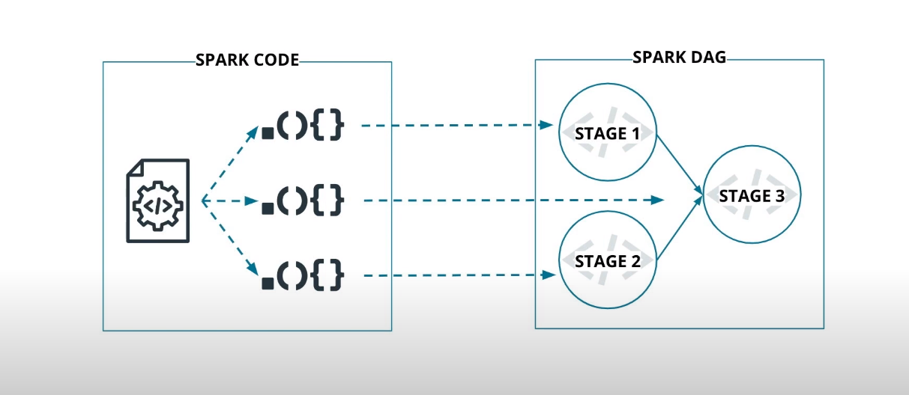
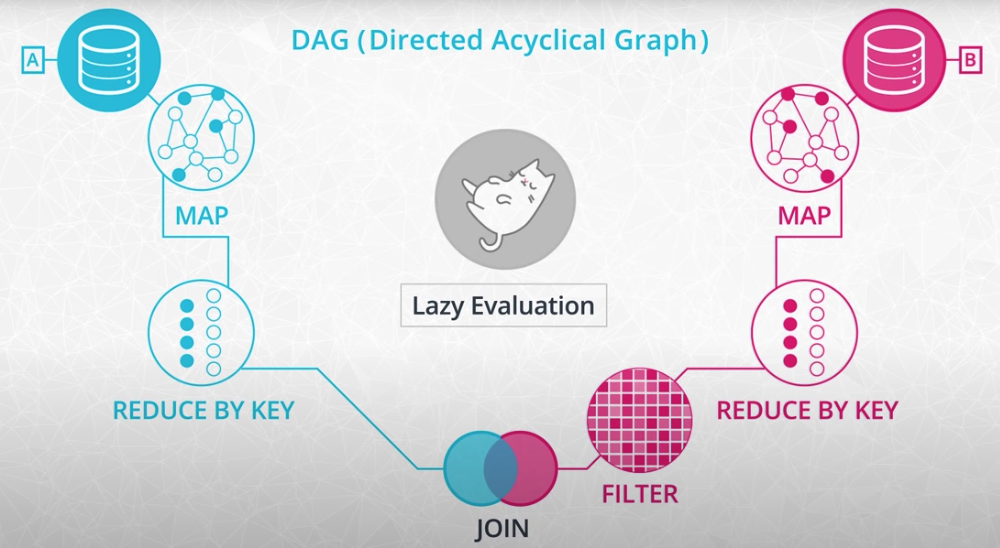
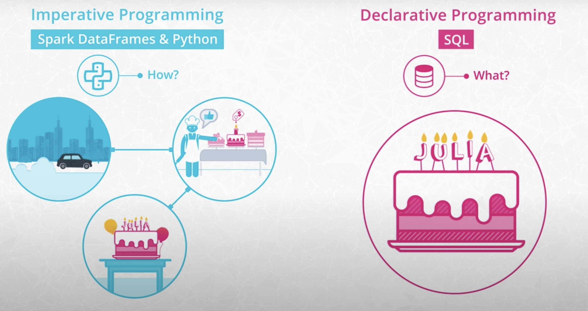

# The Spark DAG: Teamwork for Data Processing

### The Spark DAG

Apache Spark distributes data processing tasks over a cluster of distributed computing resources. How does it accomplish this?



### Cycling Team

Imagine a team of road cyclists, who share their water with each other to reduce the load of the person cycling in the front. Each time the lead cyclist rotates to the back, they take the duty of carrying the new lead cyclist's water. This works great, until they become separated.

If the lead cyclist is separated from their team, they won't have any water. For the lead cyclist to have adequate water, they must carry their own water. Similarly, in distributed systems, your program shouldn't rely on resources created by previous executions.

An idempotent program can run multiple times without any effect on the result. Some programs depend on prior state in order to execute properly. This is not considered idempotent, because they depend on that state existing before starting.

### Dividing the Work

One goal of idempotent code is that data can be processed in parallel, or simultaneously. This is done by calling the same code repeatedly in different threads, and on different nodes or servers for each chunk or block of data. If each program has no reliance on prior execution, there should be no problem splitting up processing.

When writing Spark code, it is very important to avoid reading data into regular lists or arrays, because the amount of data your code deals with can be very large. Instead, you will use special datasets called Resilient Distributed Datasets (RDDs) and DataFrames. Much like an SQL query cursor, they don't actually hold all of the data in memory. These datasets give your Spark job access to the shared resources of the cluster in a very controlled way, that is managed outside of your Spark job.

# Directed Acyclic Graph (DAG)

Similar to how cyclists carry their own water, every Spark program makes a copy of its input data and never changes the original parent data. Because Spark doesn't change or mutate the input data, it's known as immutable. But what happens when you have lots of function calls in your program?

- In Spark, you do this by chaining together multiple function calls that each accomplish a small chunk of the work.

- It may appear in your code that every step will run sequentially

- However, they may be run more efficiently if Spark finds a more optimal execution plan

Spark uses a programming concept called lazy evaluation. Before Spark does anything with the data in your program, it first builds step-by-step directions of what functions and data it will need.

In Spark, and in other similar computational processes, this is called a Directed Acyclic Graph (DAG). The reference is made to the fact that no explicit repetition is inherent in the process. For example, if a specific file is read more than once in your code, Spark will only read it one time. Spark builds the DAG from your code, and checks if it can procrastinate, waiting until the last possible moment to get the data.

A cycling team rotates their position in shifts to preserve energy. In Spark, these shifts are called stages.As you watch the output of your Spark code, you will see output similar to this:


This means your code is on stage 19 of its physical execution plan. Data is processed in parallel tasks at each stage, separated by data partitions, so data in the same partition can be processed more efficiently.



## [Spark Cluster Overview](https://spark.apache.org/docs/3.0.2/cluster-overview.html)
#

# Resilient Distributed Datasets (RDDs)

### Resilent Distributed Datasets

Spark processes data using a cluster of distributed computing resources. Source data is loaded from a database, CSV files, JSON files, or text files. Spark converts this data into an immutable collection of objects for distributed processing called a Resilent Distributed Dataset or RDD. The features of the RDD are designed for efficient data processing; it is fault-tolerant (recomputed in case of failure), cacheable, and partitioned.

RDDs are a low-level abstraction of the data. In the first version of Spark, you had to work directly with RDDs. You can think of RDDs as long lists distributed across various machines. You can still use RDDs as part of your Spark code although working with DataFrames and SQL is easier. This course won't go into the details of RDD syntax, but you can find more resources below on them.

## [Explanation of the difference between RDDs and DataFrames in Databricks](https://www.databricks.com/blog/2016/07/14/a-tale-of-three-apache-spark-apis-rdds-dataframes-and-datasets.html)

## [Spark documentation's RDD programming guide](https://spark.apache.org/docs/latest/rdd-programming-guide.html)

#


# PySpark and SparkSession

### PySpark and SparkSession

Python is one of many languages you can use to write Spark Jobs. If you choose to use Python, then you will use the PySpark library. PySpark gives you access to all the important Spark data constructs like:

- RDDs
- DataFrames
- Spark SQL

That means you can write Spark code that runs in either a Spark Cluster, in a Jupyter Notebook, or on your laptop. When you write code on your Jupyter Notebook or a laptop, Spark creates a temporary Spark node that runs locally. Because Spark uses Java, it is necessary to install the JDK on a computer used to run PySpark code.

### The SparkSession

- The first component of each Spark Program is the `SparkContext`. The `SparkContext` is the main entry point for Spark functionality and connects the cluster with the application.

- To create a `SparkContext`, we first need a `SparkConf` object to specify some information about the application such as its name and the master's nodes' IP address. If we run Spark in `local` mode, we can just put the string local as master.

- To read data frames, we need to use Spark SQL equivalent, the `SparkSession`.

- Similarity to the `SparkConf`, we can specify some parameters to create a SparkSession.
    - `getOrCreate()` for example, means that if you already have a SparkSession running, instead of creating a new one, the old one will be returned and its parameters will be modified to the new configurations.


# Maps and Lambda Functions

### Maps and Lambda Functions in Spark

One of the most common functions in Spark is `map`. It simply makes a copy of the original input data and transforms that copy according to whatever function you pass to `map`. You can think of it as directions for the data telling each input how to get to the output.

### Convert a List of Strings to Lowercase

Let's walk through an example where the data is a list of thousands of strings of song titles:

```
"Despacito",
"Nice for what",
"No tears left to cry",
"Despacito",
"Havana",
"In my feelings",
"Nice for what",
"despacito",
"All the stars"
...
```
and we want to transform the strings to lowercase:

```
"despacito",
"nice for what",
"no tears left to cry",
...
```
After some initialization, we'll convert the log of songs (just a normal Python list) to a distributed dataset that Spark can use. This uses a special `spark.sparkContext` object. The Spark Context has a method `parallelize` that takes a Python object and distributes the object across the machines in your cluster so Spark can process the dataset.

```
distributed_song_log_rdd = spark.sparkContext.parallelize(log_of_songs)

```
Once this small dataset is accessible to Spark, we want to do something with it. One example is simply converting the song title to a lowercase, a common pre-processing step to standardize your data.

```
def convert_song_to_lowercase(song):
  return song.lower()
```
Next, we can use the Spark function `map` to apply our convert_song_to_lowercase function to each song in our dataset.

```
distributed_song_log_rdd.map(convert_song_to_lowercase)
```

All of these steps will appear to run instantly but remember, the spark commands are using lazy evaluation, they haven't really converted the songs to lowercase yet. Spark will procrastinate in transforming the songs to lowercase since you might have several other processing steps like removing punctuation, Spark wants to wait until the last minute to see if it can streamline its work, and combine these into a single stage.

If we want to force Spark to take some action on the data, we can use the `collect` function, which gathers the results from all of the machines in our cluster.

```
distributed_song_log.map(convert_song_to_lowercase).collect()
```

You can also use anonymous functions in Python. Anonymous functions are a Python feature for writing functional style programs. Use the special keyword `lambda`, and then write the input of the function followed by a colon and the expected output.

```
distributed_song_log_rdd.map(lambda song: song.lower())
```

You'll see anonymous functions all over the place in Spark. They're completely optional, you could just define functions if you prefer. But lambdas are a best practice.

# Data Formats

### Data Formats

The most common data formats you might come across are CSV, JSON, HTML, and XML.

A CSV file, or comma-separated values file, stores tabular data in index format. Each line represents a record where fields are always in the same order defined usually by the first header. As the name suggests, the records are separated with a comma:

```
Name       , Address .   , City       , State, Zip
Andrea Cruz, 123 Main St., Idaho Falls, ID   , 83404
Lamh Huynh , 456 Elm St. , Santa Cruz , CA   , 95063  
```

JSON or JavaScript object notation storage records in attribute-value pairs. The values may contain simple often numeric types or arrays:

```
{
"Name":"Andrea Cruz",
"Address":"123 Main St.",
"City":"Idaho Falls",
"State":"ID",
"Zip":"83404"
},
{
"Name":"Lamh Huynh",
"Address":"456 Elm St.",
"City":"Santa Cruz",
"State":"CA",
"Zip":"95063"
}
```

HTML or hypertext markup language is a standard language for creating web pages and applications. If you scrape data from the Internet, you will need to parse HTML:

```
<!DOCTYPE html>
<html lang="en">
<div style="height: 90px">
<head>
    <meta charset="UTF-8">
    <title>STEDI Login Page</title>
    <link href="style.css" rel="stylesheet" type="text/css" />
    <link rel="shortcut icon" href= "favicon.ico" type="image/x-icon" />
</head>
<body>
<div class="page-header">
    <p></p>
</div>
<div style="text-align:center">

    <form name="loginForm" id="login" method="post" >
        <p>
            <labelfor="username">Email Address</label><br>
            <input type="text" id="username" name="username" size="25">
        </p>
    </form>
</div>
</body>
</div>
</html>
```

# Distributed Data Stores

### Distributed Data Stores

When we have so much data that we need distributed computing, the data itself often needs to be stored in a distributed way.

Distributed file systems, storage services, and distributed databases store data in a fault-tolerant way. So if a machine breaks or becomes unavailable, we don't lose the information we have collected.

Hadoop has a Distributed File System, HDFS, to store data. HDFS splits files into 64 or 128 megabyte blocks and replicates these blocks across the cluster. This way, the data is stored in a fault-tolerant way and can be accessed in digestible chunks.

In the classroom workspaces and if you installed Spark on your local machine, Spark simulates a distributed file store. If you are working on a project or in a company that runs its own cluster resources, they might use HDFS.

If you're working on the cloud, you can use a distributed data storage service on a cloud provider. Examples of distributed data services on cloud providers include:

- [Amazon Simple Storage Service, or S3](https://aws.amazon.com/pt/s3/)
- [Azure Blob Storage](https://azure.microsoft.com/en-us/products/storage/blobs/#overview)
- [Google Cloud Storage](https://cloud.google.com/storage?hl=pt-br)

# Imperative vs Declarative programming

### Imperative VS Declarative Programming

**Imperative programming using DataFrames and Python**

- Imperative programming is concerned with the How
  - 
  ```
  Let's get in the car, drive two miles down the road to my favorite bakery, go into the shop, select the cake from the counter, purchase the cake, and then drive home.
  ```

- Focus on the exact steps, how we get to the result
- Data transformations with DataFrames

**Declarative programming using SQL**

- Cares about the What
- Let's get the cake for Julia.
- concerned about the result we want to achieve
- abstraction layer of an imperative system

If you have used pandas DataFrames before, you are probably familiar with how to manipulate DataFrames programmatically. We can chain methods such as filter and group by one after another, transforming the DataFrame further and further. In the next few videos, we will dive into how to do data transformations with DataFrames and imperative programming.




#### [Spark SQL, DataFrames and Datasets Guide](https://spark.apache.org/docs/latest/sql-programming-guide.html)

#### [Generic Load/Save Functions](https://spark.apache.org/docs/latest/sql-data-sources-load-save-functions.html)

#### [DataFrame API](https://spark.apache.org/docs/3.1.1/api/python/reference/pyspark.sql.html#dataframe-apis)

# Data Wrangling with DataFrames Extra Tips

### Extra Tips for Working With PySpark DataFrame Functions

In the previous video, we've used a number of functions to manipulate our dataframe. Let's take a look at the different type of functions and their potential pitfalls.

### General functions

- `select()`: returns a new DataFrame with the selected columns
- `filter()`: filters rows using the given condition
- `where()`: is just an alias for `filter()`
- `groupBy()`: groups the DataFrame using the specified columns, so we can run aggregation on them
- `sort()`: returns a new DataFrame sorted by the specified column(s). By default the second parameter 'ascending' is True.
- `dropDuplicates()`: returns a new DataFrame with unique rows based on all or just a subset of columns
- `withColumn()`: returns a new DataFrame by adding a column or replacing the existing column that has the same name. The first parameter is the name of the new column, the second is an expression of how to compute it.

### Aggregate functions

Spark SQL provides built-in methods for the most common aggregations such as `count()`, `countDistinct()`, `avg()`, `max()`, `min()`, etc. in the pyspark.sql.functions module. These methods are not the same as the built-in methods in the Python Standard Library, where we can find `min()` for example as well, hence you need to be careful not to use them interchangeably.

In many cases, there are multiple ways to express the same aggregations. For example, if we would like to compute one type of aggregate for one or more columns of the DataFrame we can just simply chain the aggregate method after a `groupBy()`. If we would like to use different functions on different columns, `agg()` comes in handy. For example `agg({"salary": "avg", "age": "max"})` computes the average salary and maximum age.

### User defined functions (UDF)

In Spark SQL we can define our own functions with the udf method from the pyspark.sql.functions module. The default type of the returned variable for UDFs is string. If we would like to return an other type we need to explicitly do so by using the different types from the pyspark.sql.types module.

### Window functions

Window functions are a way of combining the values of ranges of rows in a DataFrame. When defining the window we can choose how to sort and group (with the `partitionBy` method) the rows and how wide of a window we'd like to use (described by `rangeBetween` or `rowsBetween`).


